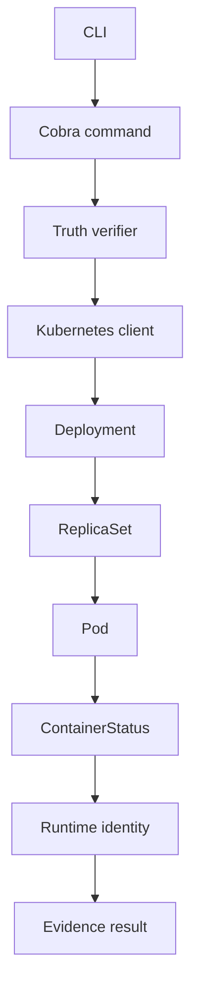

# Architecture

StateProof is a narrow, read-only evidence pipeline. It connects declared Kubernetes workload identity to the runtime image identity reported by Kubernetes, and stops at the boundary where object API evidence no longer proves application behavior.

## Execution path



The concrete production flow is:

```text
CLI
  |
  v
Cobra command
  |
  v
Kubernetes client-go
  |
  v
Real Kubernetes API
  |
  v
Truth verifier
  |
  v
Evidence model
  |
  +--> Human-readable output
  |
  +--> JSON evidence
```

## CLI layer

The `cmd/` package defines the Cobra root command and these operations:

- `verify deployment`: fetches a Deployment, discovers owned Pods, and builds a result.
- `verify workload`: identifies a named Deployment, StatefulSet, or DaemonSet. It does not perform full verification for non-Deployment types.
- `scan`: lists Deployments in a namespace and verifies each one.
- `explain deployment`: formats a computed result as explanatory text.
- `evidence deployment`: formats the result as human-readable output or JSON.

All commands obtain their Kubernetes client from the normal kubeconfig or in-cluster configuration. The optional root `--context` flag selects a kubeconfig context.

## Kubernetes access layer

`internal/k8s` wraps `client-go` interfaces. Production code reads:

- the named Deployment
- ReplicaSets in the Deployment namespace
- Pods in the Deployment namespace
- StatefulSet and DaemonSet existence when resolving `verify workload`

The client performs no Kubernetes mutation and does not request Secret objects.

## Ownership traversal

Pod discovery follows Kubernetes owner references rather than assuming names or labels:

1. Read the target Deployment.
2. List Pods in its namespace.
3. For each Pod whose owner is a ReplicaSet, read that ReplicaSet.
4. Inspect the ReplicaSet owner references.
5. Keep the Pod when the ReplicaSet is owned by the target Deployment.

This gives the runtime path:

```text
Deployment
    |
    v
ReplicaSet owner reference
    |
    v
Pod owner reference
    |
    v
ContainerStatus
    |
    v
imageID
```

ReplicaSet revisions are not independently compared or validated. A ReplicaSet that cannot be read is skipped by the current Pod-discovery helper, which can reduce the evidence available to the verifier.

## Truth verifier

`internal/truth` gathers declared image references from Deployment regular and init containers. It gathers observed image IDs from `PodStatus.ContainerStatuses` and compares them with `isDesiredMatch`:

- exact or containing image-reference matches are accepted
- digest-pinned declarations match when the declared digest appears in the runtime ID
- tagged declarations match when the runtime ID contains the same repository and a digest marker
- missing runtime identity becomes UNKNOWN evidence
- divergent replicas produce mismatch observations and can make the result PARTIAL

The verifier does not compare `ContainerStatus.Image` separately, inspect application processes, validate rollout revision consistency, or infer Secret/ConfigMap consumption.

## Evidence result

The result contains:

- the claim and Deployment subject
- the first declared container image
- the computed status
- observed container image ID observations
- source and method fields
- limitations
- evidence edges connecting the Deployment to runtime identity

The status model defines `MATCH`, `MISMATCH`, `STALE`, `PARTIAL`, `UNKNOWN`, `UNOBSERVABLE`, and `ERROR`. The current Deployment path primarily emits `MATCH`, `PARTIAL`, and `UNKNOWN`; defined statuses are not a promise that every category is independently generated today.

## Test boundary

Tests use Kubernetes API object fixtures and, where client access is exercised, fake client interfaces inside test code only. Production execution always uses the real client-go path and a real Kubernetes API configuration.
