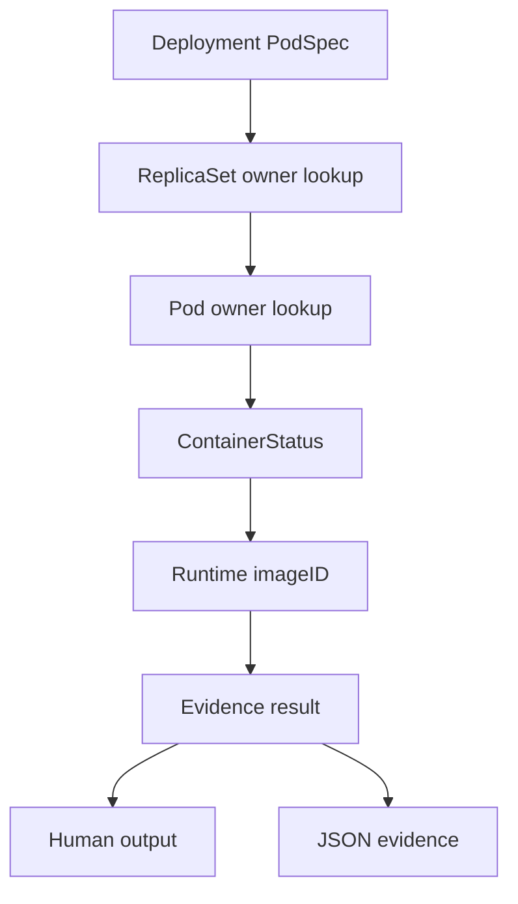
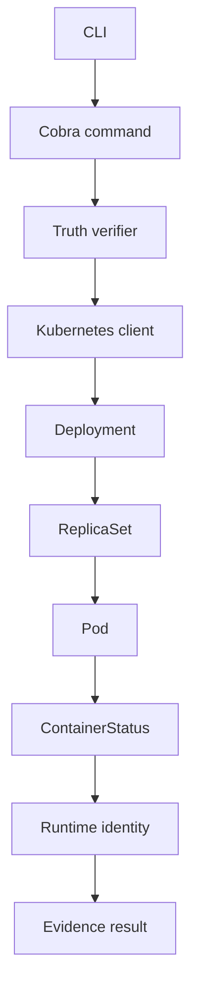

# StateProof

## Kubernetes runtime truth, backed by evidence.

StateProof is a read-only Kubernetes runtime truth verifier for one practical question:

> What did we declare, what is actually running, and what can Kubernetes prove?

Kubernetes spreads that answer across several objects. StateProof connects the objects into an evidence chain instead of presenting generic monitoring metrics:

```text
Deployment
    |
    v
ReplicaSet
    |
    v
Pod
    |
    v
Container
    |
    v
Runtime Image Identity
```

## What StateProof verifies

StateProof currently verifies Deployment runtime identity from the Kubernetes API:

- the declared container and init-container images in a Deployment PodSpec
- the ReplicaSet ownership path used to locate the Deployment's Pods
- the declared container name and image, observed container image, runtime `imageID`, readiness, state, and restart count where Kubernetes reports them
- whether runtime image identity is consistent with the declared image repository
- desired versus observed replica counts
- partial and unknown evidence when replicas disagree or runtime identity is missing
- stale ReplicaSet revision evidence when revision annotations are available
- an evidence result in human-readable or JSON form

The verifier uses the Pod's `status.containerStatuses[].imageID` as runtime identity. For a tagged declaration such as `nginx:1.25`, an image ID containing the same repository and a digest is treated as a repository-level match. A digest-pinned declaration can also match when its digest appears in the runtime image ID.

## Declared / observed / proven

### DECLARED

What the workload specification says should run: the Deployment template's container and init-container image references.

### OBSERVED

What Kubernetes reports about the live workload: Deployment objects, ReplicaSet ownership, Pods, and container runtime `imageID` values.

### PROVEN

What StateProof can establish by connecting those observations: whether observed runtime image identity is consistent with the declared workload identity, and which observations support the result.

### UNOBSERVABLE

What Kubernetes API evidence does not establish: application memory, effective in-memory configuration, actual Secret value consumption, whether application code consumed a configuration value, arbitrary process memory, or semantic application behavior. StateProof reports these boundaries as UNKNOWN or UNOBSERVABLE rather than guessing.

## Evidence model



Deployment-to-Pod discovery is implemented as follows:

1. Read the named Deployment.
2. List Pods in the namespace.
3. For each Pod owned by a ReplicaSet, read that ReplicaSet.
4. Keep the Pod when the ReplicaSet is owned by the named Deployment.
5. Compare each discovered container's `imageID` with the Deployment's declared image references.

When Deployment and ReplicaSet revision annotations are available, StateProof reports a stale-ReplicaSet finding when they differ. This is annotation comparison, not a full rollout controller-state analysis.

## What StateProof can prove

Within that boundary, StateProof can produce:

- `MATCH` when all observed runtime identities match the declared repository identity
- `PARTIAL` when observed replicas include a mismatch or mixed evidence
- `UNKNOWN` when no Pods or usable runtime identity are available
- the declared image, observed image IDs, source fields, timestamps, limitations, and evidence edges
- explicit limitations about application-level behavior and runtime process internals
- replica summary counts and structured findings for runtime divergence, missing replicas, and stale revisions

The model also defines `MISMATCH`, `STALE`, `UNOBSERVABLE`, and `ERROR`. Current Deployment verification primarily emits `MATCH`, `PARTIAL`, and `UNKNOWN`; it does not claim that every status is independently generated today.

## What it cannot prove

StateProof does not currently prove:

- application-level behavior
- application memory or arbitrary process state
- effective in-memory configuration
- Secret consumption or ConfigMap consumption
- whether a process used a referenced value
- complete rollout revision consistency beyond comparing available Deployment and ReplicaSet revision annotations
- a separate comparison of `ContainerStatus.image` versus `PodSpec.image`
- full verification for StatefulSets or DaemonSets

It does not read Secret values.

## Installation

Prerequisites:

- Go
- `kubectl`
- access to a Kubernetes cluster
- a valid kubeconfig and context

StateProof uses the normal kubeconfig configuration and supports an explicit `--context` flag. Check access before running it:

```powershell
kubectl config get-contexts
kubectl config current-context
kubectl get nodes
```

Build the CLI:

```powershell
go build -o stateproof.exe .
```

## Usage

StateProof reads existing objects and does not create infrastructure or mutate workloads.

```powershell
.\stateproof.exe verify deployment <name> --namespace <namespace>
.\stateproof.exe verify workload <name> --namespace <namespace>
.\stateproof.exe scan <namespace>
.\stateproof.exe explain deployment <name> --namespace <namespace>
.\stateproof.exe evidence deployment <name> --namespace <namespace> --json
```

### Commands

- `verify deployment` reads a Deployment, follows ReplicaSet ownership to Pods, and reports runtime identity evidence.
- `verify workload` checks whether the named object is a Deployment, StatefulSet, or DaemonSet, then prints its type. It does not run full verification for non-Deployment workloads.
- `scan` lists Deployment results for a namespace using the same read-only verification path.
- `explain deployment` renders the computed result, observations, and limitations as explanatory text.
- `evidence deployment --json` emits the computed result as structured JSON. Without `--json`, it prints the human-readable result.

`scan` also reports the number of inspected workloads and counts of actual `MATCH`, `PARTIAL`, and `UNKNOWN` results before the per-workload statuses.

### Illustrative output

This is illustrative output only. It was not captured from a real production cluster:

```text
$ stateproof verify deployment api -n production
TRUTH
Subject: deployment/production/api
Status: MATCH
Desired: api:<tag>
Observed: all observed pod imageIDs matched declared image identity
Source: Kubernetes API
```

## Architecture



The production path is CLI -> Cobra command -> Kubernetes client-go -> real Kubernetes API -> truth verifier -> evidence model -> human-readable or JSON output. Tests use Kubernetes object fixtures and fake clients only inside test code; production code does not simulate Kubernetes responses.

## Security

StateProof is intentionally read-only. The recommended least-privilege RBAC policy is [`deploy/rbac-readonly.yaml`](deploy/rbac-readonly.yaml). It grants only `get`, `list`, and `watch` on Pods and Apps API workload resources.

StateProof does not perform:

```text
create  update  patch  delete  replace  restart  exec  attach  port-forward
```

It does not request Secret objects or extract Secret values. Kubernetes API evidence remains limited to object state and reported runtime identity; it does not prove application behavior. See [`SECURITY.md`](SECURITY.md) for the detailed trust boundary.

## Testing

Unit and object-level tests run without Docker, kind, Minikube, or a Kubernetes cluster:

```powershell
go test ./...
go vet ./...
go build ./...
```

The production CLI uses a real kubeconfig-backed Kubernetes API. Real Kubernetes E2E has not been run in the current development environment because no usable Kubernetes context or API is available.

## Limitations

- Runtime identity is compared at repository/digest evidence level, not by claiming that a tag itself is immutable.
- ReplicaSet ownership lookup ignores ReplicaSets that cannot be read, so missing permissions can reduce observed evidence.
- The verifier does not inspect application processes, memory, logs, or network behavior.
- The current CLI's full verification path is Deployment-specific.
- A real cluster is required for end-to-end validation against live Kubernetes objects.

## Roadmap

Potential future work, subject to maintaining the same evidence boundary:

- richer rollout and revision consistency evidence
- explicit comparison of declared image, PodSpec image, and reported container image
- full evidence paths for additional workload types
- more direct command-level tests around JSON output and API errors

These are not claims about functionality currently implemented.

## Repository structure

```text
cmd/                    Cobra command definitions
internal/k8s/            Read-only client-go accessors
internal/truth/          Verifier, evidence model, and tests
internal/output/         Human-readable and JSON formatting
deploy/                 Least-privilege RBAC manifest
main.go                 CLI entrypoint
README.md               Project overview and usage
ARCHITECTURE.md         Implementation details
SECURITY.md             Security boundary and permissions
DEMO.md                 Existing-cluster demonstration procedure
go.mod, go.sum          Go module metadata
```
