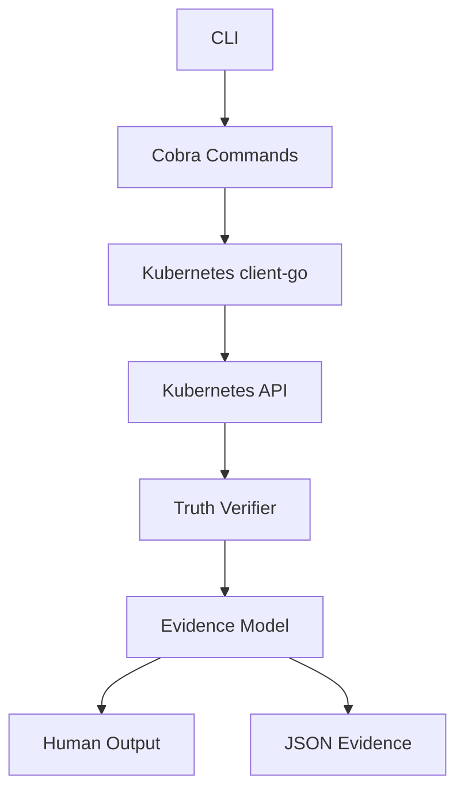

# StateProof

## Kubernetes Runtime Truth Verification

StateProof is a read-only Kubernetes runtime truth verification engine that builds evidence chains from declared workload state to live runtime identity.

The core question is: **What did we declare, what is actually running, and what can Kubernetes prove?** Kubernetes exposes desired state and runtime state through different objects. StateProof connects those objects into an evidence chain instead of presenting generic monitoring metrics.

## The evidence chain

```text
Deployment
	|
	v
ReplicaSet
	|
	v
Pod
	|
	v
Container
	|
	v
Runtime image identity
```

### Declared

The image declared by the Deployment PodSpec.

### Observed

The Pods located through Deployment and ReplicaSet ownership, plus the container runtime `imageID` reported by Kubernetes.

### Proven

StateProof can establish whether observed runtime image identity is consistent with the declared workload identity, and can expose the supporting observations and limitations.

### Unobservable

Kubernetes object state alone cannot prove application memory, effective in-memory configuration, actual Secret value consumption, whether application code consumed a configuration value, arbitrary process memory, or semantic application behavior. StateProof reports those boundaries as UNKNOWN or UNOBSERVABLE rather than guessing.

## Commands

```text
stateproof verify deployment <name> --namespace <namespace>
stateproof verify workload <name> --namespace <namespace>
stateproof scan <namespace>
stateproof explain deployment <name> --namespace <namespace>
stateproof evidence deployment <name> --namespace <namespace> --json
```

- `verify deployment` reads a Deployment and its owned Pods, then reports runtime identity evidence.
- `verify workload` identifies whether a named workload is a Deployment, StatefulSet, or DaemonSet. It does not perform full verification for non-Deployment workloads.
- `scan` summarizes Deployment verification results in a namespace.
- `explain deployment` renders the evidence and limitations in explanatory text.
- `evidence deployment --json` emits the verification result as structured JSON.

### Illustrative output

The following is illustrative output, not a claim about a real production cluster:

```text
$ stateproof verify deployment api -n production
TRUTH
Subject: deployment/production/api
Status: MATCH
Desired: api:<tag>
Observed: all observed pod imageIDs matched declared image identity
Source: Kubernetes API
```

## Architecture



The production path is CLI -> Cobra command -> Kubernetes client -> real Kubernetes API -> truth verifier -> evidence model -> human-readable or JSON output.

## Installation and usage

Prerequisites:

- Go
- `kubectl`
- access to a Kubernetes cluster
- a valid kubeconfig and context

StateProof uses the normal Kubernetes configuration from the environment. Inspect the available context before running it:

```powershell
kubectl config get-contexts
kubectl config current-context
kubectl get nodes
```

Build and run it against a safe Deployment:

```powershell
go build -o stateproof.exe .
.\stateproof.exe verify deployment <name> -n <namespace>
```

An explicit context can be selected with `--context <context>`.

## Real-cluster demo

Use an existing kubeconfig-backed Kubernetes cluster and choose a safe deployment to inspect. StateProof does not create infrastructure or mutate workloads.

```powershell
kubectl config current-context
kubectl get deployment -A
.\stateproof.exe verify deployment <name> -n <namespace>
```

## Security and permissions

StateProof is intentionally read-only. The recommended RBAC policy in [`deploy/rbac-readonly.yaml`](deploy/rbac-readonly.yaml) grants only `get`, `list`, and `watch` for the workload resources it reads. It does not require cluster-admin.

StateProof does not perform:

```text
create  update  patch  delete  exec  attach  port-forward  restart
```

It does not request Secret objects or extract Secret values. See [`SECURITY.md`](SECURITY.md) for the complete boundary.

## Testing

Unit and object-level Kubernetes tests run without a Kubernetes cluster, Docker, kind, or Minikube:

```powershell
go test ./...
go vet ./...
go build ./...
```

The production CLI uses a real kubeconfig-backed Kubernetes API. This environment currently has no configured Kubernetes context, so real Kubernetes E2E has not been executed.

## Repository structure

```text
cmd/                    Cobra command definitions
internal/k8s/            Read-only Kubernetes client access
internal/truth/          Truth verifier, evidence model, and tests
deploy/                 Least-privilege RBAC manifest
main.go                 CLI entrypoint
README.md               Project overview and usage
ARCHITECTURE.md         Implementation boundaries
SECURITY.md             Read-only and evidence limitations
DEMO.md                 Existing-cluster inspection flow
go.mod, go.sum          Go module metadata
```

## Status vocabulary

The evidence model includes `MATCH`, `MISMATCH`, `STALE`, `PARTIAL`, `UNKNOWN`, `UNOBSERVABLE`, and `ERROR`. Current Deployment verification primarily produces `MATCH`, `PARTIAL`, and `UNKNOWN`; the remaining values document the broader evidence boundary without implying unsupported proof.

## GitHub metadata

Recommended repository name:

```text
stateproof
```

Recommended description:

```text
Read-only Kubernetes runtime truth verification - building evidence chains from declared workload state to live runtime identity.
```

Suggested topics:

```text
kubernetes
go
golang
cloud-native
runtime-verification
kubernetes-security
observability
infrastructure
devops
systems
```
