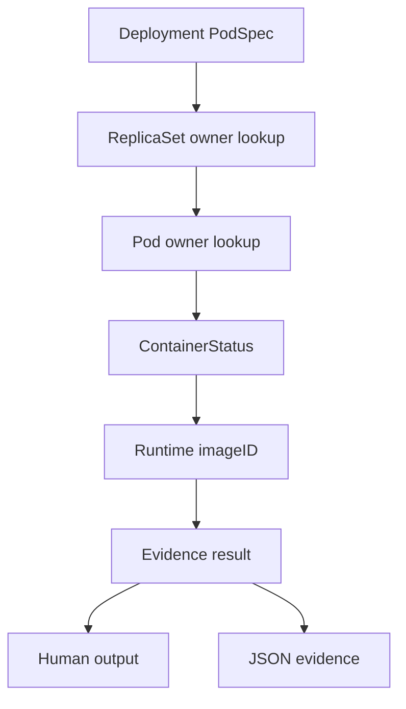
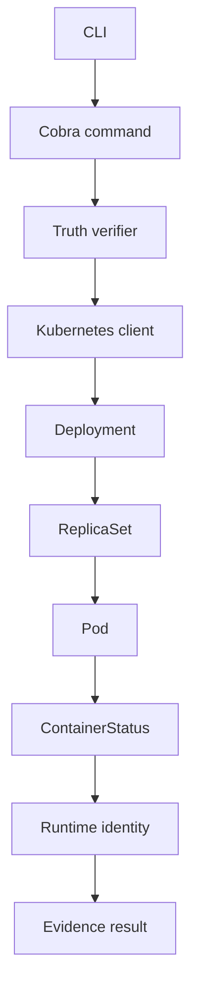

# StateProof

## Deployment runtime-image evidence, backed by Kubernetes API observations.

StateProof is a read-only Kubernetes runtime truth verifier for one practical question:

> Are the current ready Pods of this Deployment running the exact digest declared for each container?

Kubernetes spreads that answer across several objects. StateProof connects the objects into an evidence chain instead of presenting generic monitoring metrics:

```text
Deployment
    |
    v
ReplicaSet
    |
    v
Pod
    |
    v
Container
    |
    v
Runtime Image Identity
```

## What StateProof verifies

StateProof currently verifies Deployment runtime identity from the Kubernetes API:

- the declared container and init-container images in a Deployment PodSpec
- the ReplicaSet ownership path used to locate the Deployment's Pods
- the declared container name and image, observed container image, runtime `imageID`, readiness, state, and restart count where Kubernetes reports them
- whether runtime image identity is consistent with the declared image repository
- desired versus observed replica counts
- partial and unknown evidence when replicas disagree or runtime identity is missing
- stale ReplicaSet revision evidence when revision annotations are available
- an evidence result in human-readable or JSON form

The verifier uses `status.containerStatuses[].imageID` and `status.initContainerStatuses[].imageID` as runtime identity. A digest-pinned declaration can be matched to that exact digest. A tag-only declaration is `UNKNOWN`: Kubernetes API evidence cannot prove which immutable artifact a movable tag resolves to without registry evidence.

## Declared / observed / proven

### DECLARED

What the workload specification says should run: the Deployment template's container and init-container image references.

### OBSERVED

What Kubernetes reports about the live workload: Deployment objects, ReplicaSet ownership, Pods, and container runtime `imageID` values.

### PROVEN

What StateProof can establish by connecting those observations: whether observed runtime image identity is consistent with the declared workload identity, and which observations support the result.

### UNOBSERVABLE

What Kubernetes API evidence does not establish: application memory, effective in-memory configuration, actual Secret value consumption, whether application code consumed a configuration value, arbitrary process memory, or semantic application behavior. StateProof reports these boundaries as UNKNOWN or UNOBSERVABLE rather than guessing.

## Evidence model

StateProof first normalizes the Kubernetes observations it uses: Deployment
generation/replicas, Deployment-owned ReplicaSet revisions, and Pod identity,
phase, owner, readiness, and termination state. It then evaluates named normal
and init containers against their declared image references and reported runtime
image IDs. JSON is an intentional audit record, not a raw Kubernetes object
dump; findings contain stable reason codes such as `DIGEST_MATCH`,
`DIGEST_MISMATCH`, `IMMUTABLE_IDENTITY_UNAVAILABLE`, and
`CURRENT_REVISION_INCOMPLETE`.

`explain` renders those structured observations and findings as a readable
evidence chain, including the observation timestamp. It describes one API
snapshot, not continuous runtime history.



Deployment-to-Pod discovery is implemented as follows:

1. Read the named Deployment.
2. List Pods in the namespace.
3. List ReplicaSets once and map Deployment-owned ReplicaSets locally.
4. Identify the current ReplicaSet from Deployment revision metadata.
5. Verify only current-revision, Ready, non-terminating Pods.
6. Compare every declared container to the status with the same container name.

When Deployment and ReplicaSet revision annotations are available, StateProof reports a stale-ReplicaSet finding when they differ. This is annotation comparison, not a full rollout controller-state analysis.

## What StateProof can prove

Within that boundary, StateProof can produce:

- `MATCH` when all current ready Pods report every declared digest-pinned identity
- `PARTIAL` when immutable evidence proves divergence or the current revision is incomplete
- `UNKNOWN` when immutable evidence is unavailable, including tag-only declarations
- the declared image, observed image IDs, source fields, timestamps, limitations, and evidence edges
- explicit limitations about application-level behavior and runtime process internals
- replica summary counts and structured findings for runtime divergence, missing replicas, and stale revisions

The model also defines `MISMATCH`, `STALE`, `UNOBSERVABLE`, and `ERROR`. Current Deployment verification primarily emits `MATCH`, `PARTIAL`, and `UNKNOWN`; it does not claim that every status is independently generated today.

## What it cannot prove

StateProof does not currently prove:

- application-level behavior
- application memory or arbitrary process state
- effective in-memory configuration
- Secret consumption or ConfigMap consumption
- whether a process used a referenced value
- complete rollout revision consistency beyond comparing available Deployment and ReplicaSet revision annotations
- a separate comparison of `ContainerStatus.image` versus `PodSpec.image`
- full verification for StatefulSets or DaemonSets

It does not read Secret values.

## Installation

Prerequisites:

- Go
- `kubectl`
- access to a Kubernetes cluster
- a valid kubeconfig and context

StateProof uses the normal kubeconfig configuration and supports an explicit `--context` flag. Check access before running it:

```powershell
kubectl config get-contexts
kubectl config current-context
kubectl get nodes
```

Build the CLI:

```powershell
go build -o stateproof.exe .
```

## Usage

StateProof reads existing objects and does not create infrastructure or mutate workloads.

```powershell
.\stateproof.exe verify deployment <name> --namespace <namespace>
.\stateproof.exe scan <namespace>
.\stateproof.exe explain deployment <name> --namespace <namespace>
.\stateproof.exe evidence deployment <name> --namespace <namespace> --json
```

### Commands

- `verify deployment` reads a Deployment, follows ReplicaSet ownership to Pods, and reports runtime identity evidence.
- `verify workload` is intentionally unsupported: StateProof currently verifies Deployments only.
- `scan` lists Deployment results for a namespace using the same read-only verification path.
- `explain deployment` renders the computed result, observations, and limitations as explanatory text.
- `evidence deployment --json` emits the computed result as structured JSON. Without `--json`, it prints the human-readable result.

`scan` also reports the number of inspected workloads and counts of actual `MATCH`, `PARTIAL`, and `UNKNOWN` results before the per-workload statuses.

### Illustrative output

This is illustrative output only. It was not captured from a real production cluster:

```text
$ stateproof verify deployment api -n production
TRUTH
Subject: deployment/production/api
Status: MATCH
Desired: registry.example/api@sha256:<digest>
Observed: all current ready Pod container identities matched digest-pinned declarations
Source: Kubernetes API
```

## Architecture



The production path is CLI -> Cobra command -> Kubernetes client-go -> real Kubernetes API -> truth verifier -> evidence model -> human-readable or JSON output. Tests use Kubernetes object fixtures and fake clients only inside test code; production code does not simulate Kubernetes responses.

## Security

StateProof is intentionally read-only. The recommended least-privilege RBAC policy is [`deploy/rbac-readonly.yaml`](deploy/rbac-readonly.yaml). It grants only `get`, `list`, and `watch` on Pods and Apps API workload resources.

StateProof does not perform:

```text
create  update  patch  delete  replace  restart  exec  attach  port-forward
```

It does not request Secret objects or extract Secret values. Kubernetes API evidence remains limited to object state and reported runtime identity; it does not prove application behavior. See [`SECURITY.md`](SECURITY.md) for the detailed trust boundary.

## Testing

Unit and object-level tests run without Docker, kind, Minikube, or a Kubernetes cluster:

```powershell
go test ./...
go vet ./...
go build ./...
```

Real-cluster E2E is deliberately separate and requires an explicit kubeconfig:

```powershell
go test -tags=e2e -p 1 ./e2e -v
```

The tagged suite creates a temporary namespace, captures the runtime digest reported by a real kubelet, then runs the compiled production CLI for digest-match, digest-mismatch, container-swap, init-container, rollout selection, tag-only insufficient-evidence, and ReplicaSet-RBAC-denial scenarios. It never runs as part of `go test ./...`. The separate `kubernetes-e2e` GitHub Actions workflow provisions kind before running this suite.

Exit codes are `0` for match, `2` for verified drift or incomplete current revision, `3` for insufficient immutable evidence, and `1` for an operational error.

### Offline evidence comparison

Save JSON evidence at two observation times, then compare it without a cluster,
kubeconfig, or network connection:

```powershell
.\stateproof.exe evidence deployment payments -n production --json > before.json
.\stateproof.exe evidence deployment payments -n production --json > after.json
.\stateproof.exe compare before.json after.json --json
```

Snapshots use `schemaVersion: 1`. `compare` returns `0` for `NO_CHANGE`, `2`
for `CHANGED`, and `1` for malformed, unsupported, or unrelated snapshots.
It compares Kubernetes evidence, not application behavior or runtime history.

### Post-deployment CI gate

After a Deployment rollout, verify the runtime digest Kubernetes reports for a
named current-ready container. This is read-only and does not contact a registry:

```powershell
.\stateproof.exe verify workload deployment/payments -n production --expected-digest api=$env:IMAGE_DIGEST --json
```

Repeat `--expected-digest` for each normal container to gate. Exit `0` means all
observed current-ready replicas matched; `2` means drift or incomplete rollout;
`3` means immutable evidence was insufficient; `1` means an API/operational error.
The kind-backed E2E suite covers expected-digest success, valid-digest mismatch,
multi-container name matching, and RBAC denial; normal tests remain cluster-free.

The production CLI uses a real kubeconfig-backed Kubernetes API. Real Kubernetes E2E has not been run in the current development environment because no usable Kubernetes context or API is available.

## Limitations

- Tag-only images are insufficient immutable identity evidence; pin images by digest for `MATCH`.
- ReplicaSet list failures are operational errors, not silently downgraded to absent evidence.
- The verifier does not inspect application processes, memory, logs, or network behavior.
- The current CLI's full verification path is Deployment-specific.
- A real cluster is required for end-to-end validation against live Kubernetes objects.

## Roadmap

Potential future work, subject to maintaining the same evidence boundary:

- richer rollout and revision consistency evidence
- explicit comparison of declared image, PodSpec image, and reported container image
- full evidence paths for additional workload types
- more direct command-level tests around JSON output and API errors

These are not claims about functionality currently implemented.

## Repository structure

```text
cmd/                    Cobra command definitions
internal/k8s/            Read-only client-go accessors
internal/truth/          Verifier, evidence model, and tests
internal/output/         Human-readable and JSON formatting
deploy/                 Least-privilege RBAC manifest
main.go                 CLI entrypoint
README.md               Project overview and usage
ARCHITECTURE.md         Implementation details
SECURITY.md             Security boundary and permissions
DEMO.md                 Existing-cluster demonstration procedure
go.mod, go.sum          Go module metadata
```
